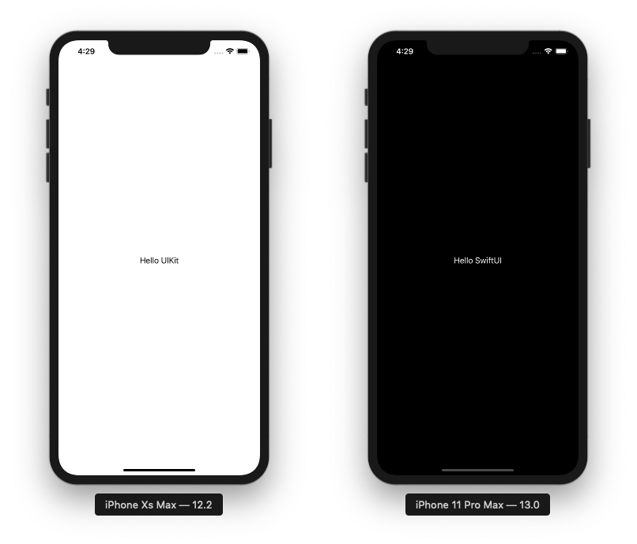

# HybridUI iOS App

A minimal project setup demonstrating how to build an App wich uses [SwiftUI](https://developer.apple.com/documentation/swiftui) on iOS 13 and later and [UIKit](https://developer.apple.com/documentation/uikit) on iOS 11 and 12.

## Notes

* Calls into SwiftUI/UIKit need to be conditional, i.e.: `if #available(iOS 13.0, *) { /* swiftui code */ } else { /* uikit code */ }`. Use this from within `AppDelegate` to conditionally instantiate either a `SwiftUI` widget or a `Storyboard`.

* Custom SwiftUI types / DSL need to be annotated using `@available(iOS 13, *)`
* The SwiftUI framework needs to be linked weakly (i.e, declared as *optional* in *Build Phases  / Link Binary With Libraries* target settings section).
* Minimal deployment target is iOS 11, the compiler throws errors otherwise when trying to compile for 32bit platforms (`armv7`).

## Screenshots

## License

[Unlicense / Public Domain](https://unlicense.org/)

